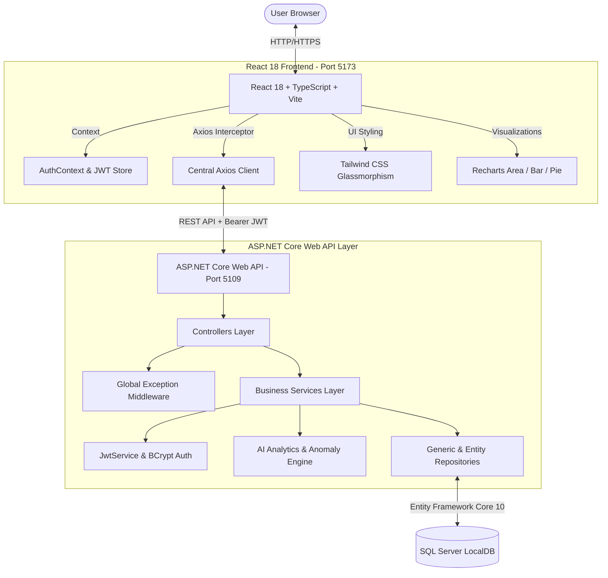

<div align="center">

# 🚗 VehicleIQ
### *Smart Vehicle Health, Expense & Predictive Intelligence Platform*

[](https://github.com)
[](https://reactjs.org/)
[](https://www.typescriptlang.org/)
[](https://vitejs.dev/)
[](https://tailwindcss.com/)
[](https://dotnet.microsoft.com/)
[](https://www.microsoft.com/sql-server)
[](https://jwt.io/)

<p align="center">
  <a href="#-key-features">Key Features</a> •
  <a href="#-system-architecture">Architecture</a> •
  <a href="#-ai--analytics-intelligence">AI Insights</a> •
  <a href="#-getting-started">Getting Started</a> •
  <a href="#-database-schema">Database</a>
</p>

---

</div>

## 🌌 Overview

**VehicleIQ** is an enterprise-grade, full-stack vehicle fleet management & analytics SaaS platform. Designed with a **futuristic dark glassmorphism UI**, it empowers users to monitor vehicle health, track fuel consumption, forecast maintenance costs, store documents securely, and receive **predictive AI alerts** for servicing and efficiency drops.

---

## ✨ Key Features

| Module | Feature Capabilities |
| :--- | :--- |
| 🔑 **JWT Authentication** | Secure registration, BCrypt password hashing, 7-day signed JWT tokens, and automatic session persistence. |
| 📊 **Interactive Dashboard** | Live KPI counters, 6-month spending trends, expense category pie chart, and upcoming due reminders. |
| 🚘 **Vehicle Garage** | Card grid with gradient headers, full vehicle specifications, current odometer, and tabbed detail views. |
| ⛽ **Fuel Log & Mileage** | Instant fuel logging with auto-calculated rolling mileage ($km/L$) and station tracking. |
| 🔧 **Service History** | Garage tracking, maintenance logs, itemized costs, and next service interval targets. |
| 💸 **Expense Tracker** | Categorized spending, monthly expenditure bar charts, and category filter pills. |
| 🧠 **AI Fleet Analytics** | Fuel efficiency anomaly detection ($>15\%$ drop alerts), predictive service due calendar, and cost-per-km ($CPK$) benchmarks. |
| 🛡️ **Insurance & PUC** | Active policy status badges, expiration warnings, and renewal tracking. |
| 📁 **Document Library** | Multi-file document storage for RC books, insurance policies, and test certificates. |

---

## 🏗️ System Architecture



---

## 🧠 AI & Analytics Intelligence

VehicleIQ features built-in algorithmic intelligence:

### 1. ⛽ Fuel Efficiency Anomaly Engine
Calculates rolling baseline mileage ($km/L$). If a new fuel log drops **$>15\%$ below baseline**, the system flags an anomaly card warning you to inspect tire pressure, air filters, or engine tuning.

### 2. 🔮 Predictive Service Due Calculator
Determines your average daily driving velocity ($km/day$) and predicts the exact calendar date when your vehicle will reach its next maintenance threshold.

### 3. 💰 Cost Per Kilometer ($CPK$) & Spend Forecasting
Calculates true ownership cost per km ($Total Spent / Total Distance$) and projects 30-day and 90-day fleet maintenance budgets using exponential smoothing run-rates.

---

## 🚀 Getting Started

### Prerequisites
- **Node.js** v20+ & **npm**
- **.NET 8/10 SDK**
- **SQL Server LocalDB** or SQL Server 2022

### 1. Clone & Set Up Backend

```bash
cd VehicleIQ.API

# Update database schema
dotnet ef database update

# Run the API server
dotnet run --launch-profile http
# API runs at http://localhost:5109
# Swagger UI available at http://localhost:5109/swagger
```

### 2. Set Up Frontend

```bash
cd VehicleIQ.React

# Install dependencies
npm install

# Run the development server
npm run dev
# Frontend runs at http://localhost:5173
```

---

## 🗄️ Database Schema

The database consists of **9 normalized relational entities** configured with EF Core Fluent API, soft-delete global query filters, and audit columns (`CreatedAt`, `UpdatedAt`):

- `Users` — Account records and hashed credentials.
- `Vehicles` — Fleet vehicles and current odometers.
- `FuelEntries` — Fuel logs and auto mileage calculations.
- `ServiceRecords` — Maintenance events and target odometers.
- `Expenses` — All categorized vehicle spending.
- `Insurances` — Coverage types and expiry dates.
- `PucCertificates` — Emission test certificates.
- `Reminders` — Kanban-style task notifications.
- `Documents` — File upload references.

---

<div align="center">

Made with ❤️ using **React**, **ASP.NET Core**, and **SQL Server**.

</div>
