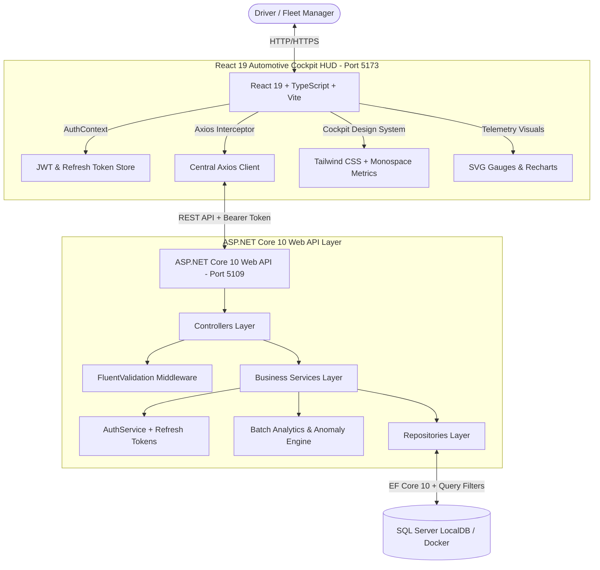

<div align="center">

# 🏎️ VehicleIQ
### *Digital Twin Automotive Cockpit & Fleet Intelligence Platform*

[](https://github.com)
[](https://reactjs.org/)
[](https://www.typescriptlang.org/)
[](https://vitejs.dev/)
[](https://tailwindcss.com/)
[](https://dotnet.microsoft.com/)
[](https://www.microsoft.com/sql-server)
[](https://jwt.io/)
[](https://www.docker.com/)

<p align="center">
  <a href="#-overview">Overview</a> •
  <a href="#-key-features">Key Features</a> •
  <a href="#-cockpit-ui-design-system">UI Design System</a> •
  <a href="#-system-architecture">Architecture</a> •
  <a href="#-ai--analytics-intelligence">AI Insights</a> •
  <a href="#-getting-started">Getting Started</a> •
  <a href="#-database-schema">Database</a>
</p>

---

</div>

## 🌌 Overview

**VehicleIQ** is a full-stack vehicle fleet management & digital twin telemetry SaaS platform. Re-engineered with an **Automotive Cockpit UI** (inspired by BMW iDrive, Tesla, and racing telemetry HUDs), it empowers vehicle owners and fleet managers to monitor vehicle health, compute rolling fuel mileage ($km/L$), forecast maintenance costs, store compliance documents, and receive **predictive AI alerts** for servicing and efficiency anomalies.

---

## ✨ Key Features

| Module / Layer | Feature Capabilities |
| :--- | :--- |
| 🔑 **JWT & Refresh Tokens** | Secure JWT authentication with database-backed **Refresh Tokens** (`/api/auth/refresh`, `/api/auth/revoke`), BCrypt password hashing, and configurable environment keys. |
| 🏎️ **Cockpit HUD Dashboard** | Live fleet health score calculation (0–100), digital twin featured vehicle hero banner, 6-month spend gradient charts, category donut breakdown, and real-time telemetry activity feed. |
| 🚘 **Garage & Digital Twins** | Garage cards featuring **Indian-style registration plates** (`IND` blue bar), health score tier badges, monospace odometers, and tabbed vehicle detail views with 3 SVG circular instrument gauges. |
| ⛽ **Fuel Telemetry Log** | Dedicated refuel logger with SVG rolling mileage ($km/L$) gauge, price-per-liter calculation, and full-tank efficiency math. |
| 🔧 **Service History Ledger** | Itemized workshop logs, synthetic oil tracking, invoice costs, and next service target odometer countdowns. |
| 💸 **Financial Spend Ledger** | Categorized expense entries, 6-month financial spend run-rate bar chart, and category filter pills. |
| 🛡️ **Insurance & PUC Vaults** | Statutory policy tracking with color-coded expiry countdowns (Green / Amber / Red) and compliance badges. |
| 🔔 **Reminders Kanban** | Overdue alert badges, status action buttons (*Done*, *Snooze +3/7/14 days*, *Dismiss*, *Reopen*), and vehicle filters. |
| 📁 **Document Vault** | Multi-file encrypted document storage for RC books, insurance papers, PUC certificates, and service invoices. |
| 🗑️ **Soft Delete Safeguards** | Auditable soft-deletion (`IsDeleted` EF query filters) with clear confirmation dialogs protecting historical data. |
| 🛡️ **Production Security & Quality** | FluentValidation request validation, standardized `PagedResult<T>` pagination DTOs, batch-query N+1 resolution in `AnalyticsService`, multi-stage Dockerfile, docker-compose, and GitHub Actions CI. |
| 🧠 **AI Fleet Analytics** | Fuel efficiency anomaly detection ($>15\%$ drop alerts), predictive service due calendar, and cost-per-km ($CPK$) benchmarks. |

---

## 🎨 Cockpit UI Design System

The frontend application uses a custom-built **Automotive Cockpit Design System**:

- **Dark Night-Mode Surface**: Base background `#0B0B0C` with solid `#1C1C1F` cockpit card containers and a subtle dark dot grid texture.
- **Telemetry Typography**: **DM Sans** for interface labels paired with **JetBrains Mono** for all telemetry metrics, odometers, fuel economy ($km/L$), cost-per-km ($CPK$), currency amounts, and timestamps.
- **Tactile Colors**: Amber primary accent (`#F59E0B`), Emerald green health (`#22C55E`), Crimson red warning (`#EF4444`), and Electric blue info (`#3B82F6`).
- **Instrument Gauges**: SVG circular gauges ([GaugeRing.tsx](file:///c:/Users/KESHAV-K-INTERN/Desktop/Vehicle%20PO/VehicleIQ.React/src/components/cockpit/GaugeRing.tsx)) and Indian-style registration plates ([RegistrationPlate.tsx](file:///c:/Users/KESHAV-K-INTERN/Desktop/Vehicle%20PO/VehicleIQ.React/src/components/cockpit/RegistrationPlate.tsx)).

---

## 🏗️ System Architecture


```mermaid
graph TD
    User([Driver / Fleet Manager]) <-->|HTTP/HTTPS| ReactApp[React 19 + TypeScript + Vite]
    
    subgraph Frontend Layer [React 19 Automotive Cockpit HUD - Port 5173]
        ReactApp -->|AuthContext| AuthState[JWT & Refresh Token Store]
        ReactApp -->|Axios Interceptor| AxiosClient[Central Axios Client]
        ReactApp -->|Cockpit Design System| CockpitUI[Tailwind CSS + Monospace Metrics]
        ReactApp -->|Telemetry Visuals| Gauges[SVG Gauges & Recharts]
    end

    AxiosClient <-->|REST API + Bearer Token| API[ASP.NET Core 10 Web API - Port 5109]

    subgraph Backend Layer [ASP.NET Core 10 Web API Layer]
        API --> Controllers[Controllers Layer]
        Controllers --> Validation[FluentValidation Middleware]
        Controllers --> Services[Business Services Layer]
        Services --> AuthService[AuthService + Refresh Tokens]
        Services --> AnalyticsService[Batch Analytics & Anomaly Engine]
        Services --> Repositories[Repositories Layer]
    end

    Repositories <-->|EF Core 10 + Query Filters| SQL[(SQL Server LocalDB / Docker)]
```

---

## 🧠 AI & Analytics Intelligence

VehicleIQ features built-in algorithmic intelligence:

### 1. ⛽ Fuel Efficiency Anomaly Engine
Calculates rolling baseline mileage ($km/L$). If a new fuel log drops **$>15\%$ below baseline**, the system flags an anomaly card warning you to inspect tire pressure, air filters, or engine tuning.

### 2. 🔮 Predictive Service Due Calculator
Determines your average daily driving velocity ($km/day$) and predicts the exact calendar date when your vehicle will reach its next maintenance threshold.

### 3. 💰 Cost Per Kilometer ($CPK$) & Spend Forecasting
Calculates true ownership cost per km ($Total Spent / Total Distance$) and projects 30-day and 90-day fleet maintenance budgets using exponential smoothing run-rates.

---

## 🚀 Getting Started

### Prerequisites
- **Node.js** v20+ & **npm**
- **.NET 8/10 SDK**
- **SQL Server LocalDB** or SQL Server 2022 / Docker

---

### ⚡ 1-Command Quick Start (Recommended)

Run any of the following single commands from the project root directory:

```cmd
# Option 1: Via npm (cross-platform)
npm start

# Option 2: Via batch file
.\start.bat

# Option 3: Via PowerShell
.\start.ps1
```

This single command automatically:
1. Starts the ASP.NET Core API backend on `http://localhost:5109`
2. Starts the React Vite Cockpit UI on `http://localhost:5173`
3. Opens `http://localhost:5173` in your default web browser

---

### 🐳 Docker Setup

Run the full stack via Docker Compose:

```bash
docker-compose up --build
```

---

### Step-by-Step Manual Setup

#### 1. Set Up Backend

```bash
cd VehicleIQ.API

# Update database schema
dotnet ef database update

# Run the API server
dotnet run
# API runs at http://localhost:5109
# Swagger UI available at http://localhost:5109/swagger
```

#### 2. Set Up Frontend

```bash
cd VehicleIQ.React

# Install dependencies
npm install

# Run the development server
npm run dev
# Frontend runs at http://localhost:5173
```

---

## 🗄️ Database Schema

The database consists of **10 normalized relational entities** configured with EF Core Fluent API, soft-delete global query filters (`IsDeleted`), and audit columns (`CreatedAt`, `UpdatedAt`):

- `Users` — Account records, BCrypt hashed credentials, and role claims.
- `RefreshTokens` — Secure refresh token hashes, expiration, and revocation status.
- `Vehicles` — Fleet vehicle specifications, odometers, and soft-delete flag.
- `FuelEntries` — Fuel refuel logs and automatic mileage calculations.
- `ServiceRecords` — Maintenance events, invoice costs, and target odometers.
- `Expenses` — Itemized vehicle expenditures and category tags.
- `Insurances` — Coverage types, annual premiums, and policy expiry dates.
- `PucCertificates` — Emission test certificates and renewal dates.
- `Reminders` — Kanban-style task notifications and snooze state.
- `Documents` — File upload metadata and file path references.

---

<div align="center">

Made with ❤️ using **React 19**, **Vite 8**, **ASP.NET Core 10**, **Tailwind CSS**, and **SQL Server**.

</div>
